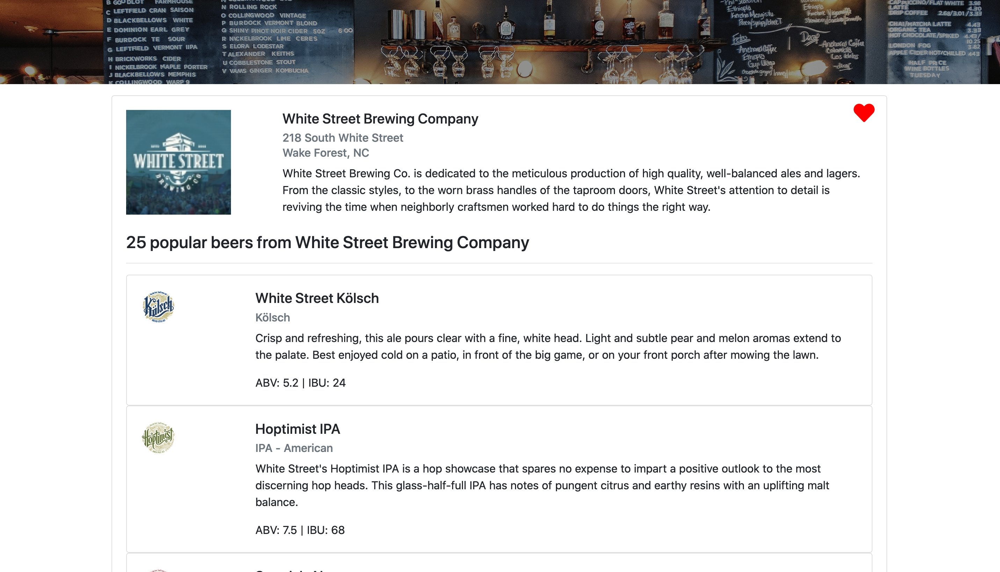

# Brewery Search SQL

Brewery Search is a full stack web application which allows users to search, save, and rate breweries. Brewery Search is powered
via ReactJS with a C# RESTful API backed up by an SQL database (MSSQL).

Deployed at: https://brewerysearch.azurewebsites.net/

# Brewery Search Page

# Brewery Info and Beer List

# Saved Breweries

## Technologies used

- C#
- .Net Core
- AutoMapper.Extensions.Microsoft.DependencyInjections
- Microsoft.AspNetCore.JsonPatch
- Microsoft.AspNetCore.Mvc.NewtonSoftJson
- Microsoft.AspNetCore.SpaServices.Extensions
- Microsoft.EntityFrameworkCore
- Microsoft.EntityFrameworkCore.Design
- ReactJS
- JavaScript
- Bootstrap
- Azure for deployment
- MSSQL
